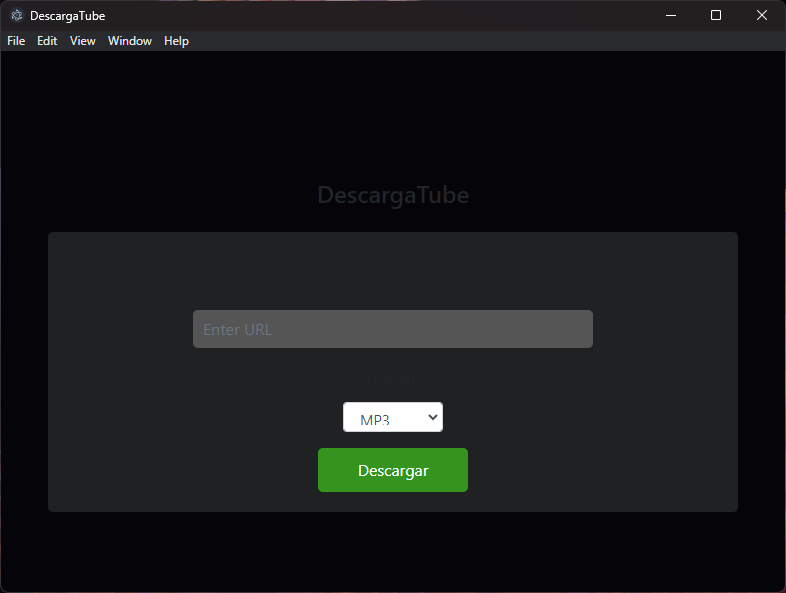

# DescargaTube


## Descripción

Este proyecto utiliza Electron para crear una aplicación de escritorio que permite descargar archivos de YouTube en formatos MP3 o MP4. La aplicación utiliza Express como servidor backend para gestionar las descargas y Fluent-ffmpeg para convertir los archivos descargados a formato MP3 cuando se elige esa opción.

## Funciones Principales

### Descarga de Videos

La aplicación permite al usuario ingresar la URL de un video de YouTube, seleccionar el formato de descarga (MP3 o MP4), y luego iniciar la descarga. La aplicación proporciona retroalimentación sobre el estado de la descarga.

### Conversión a MP3 (opcional)

Cuando se elige el formato MP3, la aplicación utiliza Fluent-ffmpeg para convertir el archivo descargado de formato webm a MP3.

## Detalle Técnico

### Electron
La aplicación está construida con Electron, un marco que permite desarrollar aplicaciones de escritorio multiplataforma utilizando tecnologías web estándar como HTML, CSS y JavaScript. La ventana principal se crea con Electron y se carga con una página HTML.

### Express
El backend de la aplicación utiliza Express, un marco de aplicación web para Node.js. Se define una API REST para manejar las solicitudes de descarga de videos. El servidor Express también sirve archivos estáticos desde el directorio 'public'.

### youtube-dl, axios y ffmpeg
La descarga y conversión de videos se gestionan con la combinación de las bibliotecas youtube-dl-exec, axios y fluent-ffmpeg. youtube-dl-exec se utiliza para descargar videos de YouTube, axios para obtener el título del video a partir de su URL, y fluent-ffmpeg para convertir el archivo descargado a MP3 si se elige ese formato.

### Preload
El archivo preload.js se utiliza para habilitar el acceso a las API de Node.js desde el contexto del renderizado de la ventana. En este caso, se expone require para permitir que las páginas web tengan acceso a las funciones de Node.js.

### Frontend
La interfaz de usuario está construida con HTML, CSS y JavaScript. Se utiliza Bootstrap para el estilo y jQuery para la manipulación del DOM. La página principal permite al usuario ingresar la URL del video, elegir el formato de descarga y luego iniciar la descarga. Se proporciona retroalimentación visual sobre el progreso de la descarga.

### Instrucciones de Ejecución
CLonar el repositorio:
```
git clone https://github.com/juandejunin/download-electron.git
```
Instale las dependencias con npm install.
```
npm install
```
Inicie la aplicación con npm start.
```
npm start
```
Nota: Asegúrese de tener Node.js y npm instalados en su sistema.
